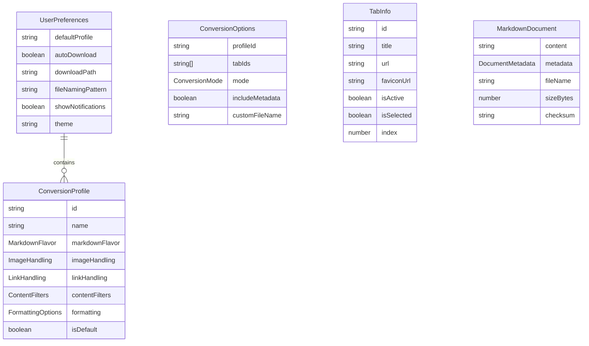

# Data Model: Copy as Markdown Chrome Extension

**Date**: 2025-09-13
**Version**: 1.0.0

## Entity Relationship Diagram



## Core Entities

### 1. UserPreferences
**Purpose**: Stores user's global extension settings
**Persistence**: chrome.storage.sync

```typescript
interface UserPreferences {
  defaultProfile: string;              // ID of default conversion profile
  autoDownload: boolean;               // Auto-download vs copy to clipboard
  downloadPath?: string;               // Custom download path (if supported)
  fileNamingPattern: NamingPattern;    // How to name downloaded files
  showNotifications: boolean;          // Show success/error notifications
  theme: 'light' | 'dark' | 'system';  // UI theme preference
  shortcuts?: KeyboardShortcuts;       // Custom keyboard shortcuts
  recentProfiles?: string[];          // Recently used profile IDs
}

enum NamingPattern {
  TAB_TITLE = 'tab_title',
  DOMAIN_TITLE = 'domain_title',
  CUSTOM_PREFIX = 'custom_prefix',
  TIMESTAMP = 'timestamp',
  MIXED = 'mixed' // Combination of patterns
}
```

### 2. ConversionProfile
**Purpose**: Reusable conversion configuration sets
**Persistence**: chrome.storage.sync

```typescript
interface ConversionProfile {
  id: string;                          // UUID
  name: string;                        // User-friendly name
  markdownFlavor: MarkdownFlavor;      // CommonMark, GFM, minimal
  imageHandling: ImageHandling;        // How to handle images
  linkHandling: LinkHandling;          // How to handle links
  contentFilters: ContentFilters;      // What to include/exclude
  formatting: FormattingOptions;       // Formatting preferences
  isDefault: boolean;                  // Is this the default profile
  createdAt: number;                   // Timestamp
  updatedAt: number;                   // Timestamp
}

enum MarkdownFlavor {
  COMMONMARK = 'commonmark',
  GFM = 'gfm',                         // GitHub Flavored Markdown
  MINIMAL = 'minimal'                  // Basic markdown only
}

interface ImageHandling {
  strategy: 'link' | 'skip' | 'download' | 'base64';
  maxWidth?: number;                   // Max image width in markdown
  lazyLoadHandling: boolean;          // Handle lazy-loaded images
}

interface LinkHandling {
  style: 'absolute' | 'relative' | 'reference' | 'remove';
  openInNewTab?: boolean;             // Add target="_blank" equivalent
  trackingRemoval: boolean;           // Remove tracking parameters
}

interface ContentFilters {
  includeCss: string[];                // CSS selectors to include
  excludeCss: string[];                // CSS selectors to exclude
  includeHidden: boolean;              // Include hidden elements
  includeComments: boolean;            // Include HTML comments
  includeScripts: boolean;             // Include script content
  maxHeadingLevel: number;             // 1-6, max heading to preserve
}

interface FormattingOptions {
  lineWidth?: number;                  // Wrap at line width
  codeBlockSyntax: boolean;           // Enable syntax highlighting
  tableAlignment: boolean;            // Align table columns
  listIndentation: number;            // Spaces for list indentation
  boldStyle: '**' | '__';             // Bold syntax preference
  italicStyle: '*' | '_';             // Italic syntax preference
}
```

### 3. ConversionOptions
**Purpose**: Runtime options for a conversion operation
**Persistence**: Temporary (runtime only)

```typescript
interface ConversionOptions {
  profileId: string;                   // Which profile to use
  tabIds: string[];                    // Tab IDs to convert
  mode: ConversionMode;                // Copy or download
  includeMetadata: boolean;            // Add metadata header
  customFileName?: string;             // Override filename
  batchMode?: BatchMode;               // How to handle multiple tabs
}

enum ConversionMode {
  COPY = 'copy',                       // Copy to clipboard
  DOWNLOAD = 'download',               // Download as file
  BOTH = 'both'                        // Copy and download
}

enum BatchMode {
  SEPARATE = 'separate',               // Individual files
  COMBINED = 'combined',               // Single combined file
  ZIP = 'zip'                          // Zip archive
}
```

### 4. TabInfo
**Purpose**: Browser tab metadata for selection UI
**Persistence**: Temporary (runtime only)

```typescript
interface TabInfo {
  id: string;                          // Chrome tab ID
  title: string;                       // Page title
  url: string;                         // Page URL
  faviconUrl?: string;                 // Favicon URL
  isActive: boolean;                   // Currently active tab
  isSelected: boolean;                 // User selected for conversion
  index: number;                       // Tab position
  status: 'loading' | 'complete';      // Loading status
  audible?: boolean;                   // Is playing audio
  pinned?: boolean;                    // Is pinned
}
```

### 5. MarkdownDocument
**Purpose**: Converted markdown output
**Persistence**: Temporary (runtime only)

```typescript
interface MarkdownDocument {
  content: string;                     // Markdown content
  metadata: DocumentMetadata;          // Document metadata
  fileName: string;                    // Suggested filename
  sizeBytes: number;                  // Content size
  checksum?: string;                  // MD5/SHA hash
  generatedAt: number;                // Timestamp
}

interface DocumentMetadata {
  title: string;                      // Page title
  url: string;                        // Source URL
  author?: string;                    // Page author if available
  description?: string;               // Page description
  publishDate?: string;               // Publication date if available
  convertedAt: string;                // Conversion timestamp
  converterVersion: string;           // Extension version
  profile: string;                    // Profile name used
  wordCount?: number;                 // Word count
  imageCount?: number;                // Number of images
  linkCount?: number;                 // Number of links
}
```

## State Transitions

### Conversion Flow States
```
IDLE -> PREPARING -> EXTRACTING -> CONVERTING -> PROCESSING -> COMPLETE
                |                      |              |
                v                      v              v
              ERROR                  ERROR         ERROR
```

### Tab Selection States
```
UNSELECTED <-> SELECTED -> PROCESSING -> PROCESSED
                   |            |
                   v            v
                DISABLED     ERROR
```

## Validation Rules

### UserPreferences Validation
- `fileNamingPattern` must be valid enum value
- `theme` must be one of: light, dark, system
- `shortcuts` must not conflict with browser defaults

### ConversionProfile Validation
- `id` must be valid UUID v4
- `name` must be 1-50 characters
- `maxHeadingLevel` must be between 1-6
- `lineWidth` if set, must be between 40-120
- `listIndentation` must be between 2-8

### ConversionOptions Validation
- `profileId` must exist in stored profiles
- `tabIds` must contain at least one valid tab
- `customFileName` if set, must be valid filename

### TabInfo Validation
- `url` must be valid URL
- `title` must not be empty
- `index` must be >= 0

### MarkdownDocument Validation
- `content` must not be empty
- `fileName` must be valid for file system
- `sizeBytes` must match content.length
- `metadata.convertedAt` must be ISO 8601 format

## Storage Schemas

### Chrome Storage Structure
```typescript
interface StorageSchema {
  // chrome.storage.sync (small, synced data)
  preferences: UserPreferences;
  profiles: ConversionProfile[];

  // chrome.storage.local (larger, local data)
  recentConversions: RecentConversion[];
  cache?: ConversionCache;
}

interface RecentConversion {
  id: string;
  url: string;
  title: string;
  timestamp: number;
  profileUsed: string;
  sizeBytes: number;
}

interface ConversionCache {
  [url: string]: {
    content: string;
    timestamp: number;
    expires: number;
  }
}
```

## Migration Strategy

### Version 1.0.0 -> Future
```typescript
interface Migration {
  fromVersion: string;
  toVersion: string;
  migrate: (oldData: any) => any;
}

const migrations: Migration[] = [
  // Future migrations will be added here
];
```

## Performance Considerations

### Size Limits
- UserPreferences: < 4KB
- Single ConversionProfile: < 2KB
- All profiles combined: < 50KB
- MarkdownDocument: No hard limit (memory constrained)
- Cache entries: 1MB per URL

### Indexing
- Profiles indexed by `id` for O(1) lookup
- Recent conversions indexed by `timestamp` for sorting
- Cache entries use LRU eviction when > 10MB total

## Security Considerations

### Data Sanitization
- All user input sanitized before storage
- File names sanitized for file system compatibility
- URLs validated against malicious patterns
- HTML content sanitized before conversion

### Privacy
- No telemetry or analytics
- All data stored locally or in user's sync storage
- No external API calls for conversion
- Image URLs not pre-fetched without user consent